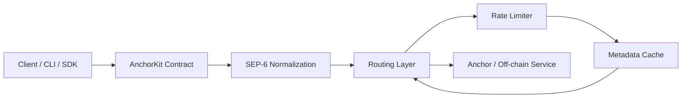

# AnchorKit Architecture

This document explains how the core AnchorKit components interact, including the typical data flow for a deposit operation.

## Component Interaction

AnchorKit is designed as a layered integration stack. A typical deposit request passes through the following components:

- **Client / CLI / SDK**: The user-facing entry point that creates requests.
- **AnchorKit Contract**: The core contract logic and on-chain validation layer.
- **SEP-6 Normalization**: A service layer that adapts anchor deposit/withdrawal responses to a canonical shape.
- **Routing**: Selects the correct anchor endpoint for the requested asset/service.
- **Rate Limiter**: Protects anchor backends by throttling or delaying requests.
- **Metadata Cache**: Stores anchor capabilities, limits, and discovery data for fast reuse.

### Mermaid diagram



### ASCII diagram

```
Client / CLI / SDK
        |
        v
AnchorKit Contract
        |
        v
SEP-6 Normalization
        |
        v
Routing Layer
        |
        v
Rate Limiter
        |
        v
Metadata Cache
        |
        v
Anchor / Off-chain Service
```

## Deposit data flow

1. The client sends a deposit request, including asset, amount, subject, and optional metadata.
2. The AnchorKit contract validates the request and prepares the canonical service call.
3. The SEP-6 normalization layer maps the request and the anchor response into a stable `DepositResponse` shape.
4. The routing layer selects the best anchor endpoint for the requested asset and service.
5. The rate limiter evaluates the request using configured thresholds and may delay or reject traffic.
6. The metadata cache provides cached anchor capabilities, fee limits, and service availability to improve routing decisions.
7. The request is forwarded to the anchor service.
8. The anchor response is normalized, validated, and returned to the client.

## Why this matters

This architecture separates transport logic from business rules and makes AnchorKit easier to extend:

- **Contract** handles state and policy.
- **SEP-6** ensures service responses are normalized.
- **Routing** selects the correct endpoint.
- **Rate limiting** protects backend anchors.
- **Caching** improves performance and avoids repeated discovery.

## Module Reference

All source modules and their responsibilities:

| Module | File | Responsibility |
|---|---|---|
| Module declarations | `src/lib.rs` | Re-exports public APIs and declares all `mod` entries; contains no business logic |
| Core contract | `src/contract.rs` | On-chain entry points, attestor registration, attestation submission and retrieval |
| Storage | `src/storage.rs` | Persistent key/value storage helpers and TTL management |
| Events | `src/events.rs` | Contract event definitions emitted on every state change |
| Types | `src/types.rs` | Shared data structures used across modules |
| Errors | `src/errors.rs` | `AnchorKitError`, stable `ErrorCode` values (100-120), and the `Error` alias |
| SEP-6 | `src/sep6.rs` | Normalized deposit/withdrawal service layer; adapts anchor responses to a canonical `DepositResponse`/`WithdrawalResponse` shape |
| Rate limiter | `src/rate_limiter.rs` | Per-attestor sliding-window rate limiting to prevent spam and abuse |
| Retry | `src/retry.rs` | Configurable exponential-backoff retry logic for off-chain anchor requests |
| Domain validator | `src/domain_validator.rs` | HTTPS-only URL validation for anchor domain inputs before any outbound request |
| Response validator | `src/response_validator.rs` | Schema validation for anchor API responses; rejects responses with missing required fields |
| Transaction state tracker | `src/transaction_state_tracker.rs` | Tracks deposit/withdrawal lifecycle states (Pending → InProgress → Completed/Failed) |
| SEP-10 JWT | `src/sep10_jwt.rs` | Minimal Ed25519 / EdDSA JWT verification for SEP-10 anchor authentication tokens |
| Deterministic hash | `src/deterministic_hash.rs` | Canonical payload hashing used for off-chain ↔ on-chain attestation matching |
| Replay window | `src/replay_window.rs` (via `lib.rs`) | Nonce-based replay-attack prevention |

### Module interaction summary

```
Client request
    │
    ▼
contract.rs          ← on-chain entry point; calls storage, events, types, errors
    │
    ├── domain_validator.rs   validates anchor URL before any outbound call
    ├── sep6.rs               normalises deposit/withdrawal responses
    │       └── retry.rs      retries failed off-chain requests with backoff
    ├── rate_limiter.rs       enforces per-attestor submission limits
    ├── response_validator.rs checks that anchor API responses are well-formed
    ├── transaction_state_tracker.rs  tracks transaction lifecycle
    ├── sep10_jwt.rs          verifies SEP-10 Ed25519 JWT tokens
    └── deterministic_hash.rs produces canonical hashes for attestation matching
```
